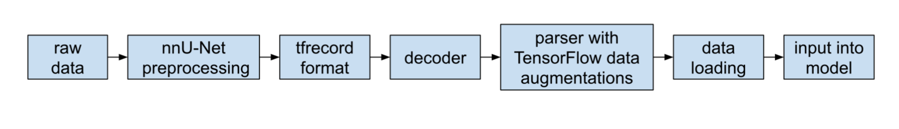

# TensorFlow nnUNet 
This TensorFlow nnUNet code is implemented based on TensorFlow volumetric models from TensorFlow Model Garden vision projects. We reuse PyTorch nnUNet's data ingestion, parsing and pre-processing components and convert the final output to a TF Vision compatible format, tfrecord. The pre-processed data is then trained and validated with our modified TF volumetric models. The data processing pipeline is as follows:



&nbsp;
## Environment Setup
TF nnUNet is developed under TF Model Garden framework. The TensorFlow Model Garden code is installed as a pip package.

TF nnUNet code is tested with Python 3.9.7 and TensorFlow 2.10.0. 

All the requirements could be installed by using pip:

```bash
pip3 install -r requirements.txt
```

&nbsp;
## Pytorch nnUNet for Data Pre-processing
### Download Dataset
Download Medical Segmentation Decathlon datasets from http://medicaldecathlon.com. 

### Pytorch nnUNet Installation 
Install nnUNet by following the instructions on [nnUNet codebase](https://github.com/MIC-DKFZ/nnUNet). Set up environment variables to let nnUNet know where raw data, preprocessed data and trained model weights are stored.

### Dataset Conversion
Convert the datasets into the correct format by following [dataset conversion instructions](https://github.com/MIC-DKFZ/nnUNet/blob/master/documentation/dataset_conversion.md). The converted dataset can be found in `$nnUNet_raw_data_base/nnUNet_raw_data`.

### Data Preprocessing
Run `nnUNet_plan_and_preprocess` by following the [experiment planning and preprocessing](https://github.com/MIC-DKFZ/nnUNet#experiment-planning-and-preprocessing) section. It will preprocess rew data in `$nnUNet_raw_data_base/nnUNet_raw_data/TaskXXX_MYTASK` and populate preprocessed data in `$nnUNet_preprocessed/TaskXXX_MYTASK`.

&nbsp;
## TFRecord Conversion
`data_conversion/tfrecord_conversion.py` converts the preprocessed data to tfrecord files, so that the data format is compatible with TF Vision. The dataset is split to 5 folds according to a splits file located in `$nnUNet_preprocessed/TaskXXX_MYTASK/splits_final.pkl`. A fold number is added as a prefix to the name of every data sample. For example, after tfrecord conversion, a npz data sample `hippocampus_001.npz` is converted to tfrecord format file `fold0_val_hippocampus_001.tfrecord`. The prefix, `fold0_val`, means when we do 5-fold cross validation, this sample is in the validation set of fold 0. We can use samples with other prefixes as training set, and all the samples with prefix `fold0_val` as validation set. All the converted data samples are saved in a folder under `$nnUNet_preprocessed/TaskXXX_MYTASK`. The folder name, `3d_tfrecord_data` or `2d_tfrecord_data`, indicates the network architecture.

```bash
python3 data_conversion/tfrecord_conversion.py \
--data_path= $nnUNet_preprocessed \
--task=4 \
--network=3d
```

&nbsp;
## Train TF nnUNet Model 
The experiment configurations can be found in yaml files under the experiments folder, `experiments`. Yaml files for all 7 datasets in MSD are provided, marked as task 001 to 007. Users can also customize configurations for other datasets by changing the parameters in the yaml file. The parameters can be obtained by Pytorch nnUNet preprocessing.

All the parameters for data augmentations are given in `dataloaders/segmentation_input_3d_msd.py`. The customized dataloader file includes the data augmentation functions and corresponding parameters for the 3d architecture model of all MSD tasks. All the tensorflow data augmentations are implemented in the `data_augmentations` folder.

To train the model, you can run the following lines with overriding some parameters in yaml file. You may replace the code path of train.py at first. Then give the path of yaml file to `--config_file` for experiment configurations, which is basically under `experiments` folder with task id number. The file path of `--model_dir` indicates where you save the trained checkpoint. In `--params_override`, you may change the fold number from 5 fold split. The following example uses fold 0 as validation set.

```bash
python train.py \
--experiment=seg_unet3d_test \
--mode=train_and_eval \
--config_file=experiments/task_004/params_3d.yaml \
--model_dir=$OUTPUT_PATH \
--params_override="task.train_data.input_path=[ \
$nnUNet_preprocessed/Task004_Hippocampus/3d_tfrecord_data/fold1*, \
$nnUNet_preprocessed/Task004_Hippocampus/3d_tfrecord_data/fold2*, \
$nnUNet_preprocessed/Task004_Hippocampus/3d_tfrecord_data/fold3*, \
$nnUNet_preprocessed/Task004_Hippocampus/3d_tfrecord_data/fold4*], \
task.validation_data.input_path= \
$nnUNet_preprocessed/Task004_Hippocampus/3d_tfrecord_data/fold0*, \
trainer.checkpoint_interval=2500, \
trainer.validation_interval=2500, \
trainer.steps_per_loop=2500, \
trainer.summary_interval=2500, \
trainer.train_steps=25000"
```

The results by 5-fold cross-validation of our TF nnUNet implementation are as follows. Note our model can achieve comparable performance with less training epochs.
<!--  -->

|  Dataset  | Epochs | Label       | TF nnU-Net              | nnU-Net <br> (1000 epochs)
|  -------  | ------ | ----------- | ----------------------- | --------------------------
|BrainTumour| 100    | 1<br>2<br>3 | 0.793<br>0.599<br>0.762 | 0.807<br>0.622<br>0.791 
| Heart     | 10     | 1           | 0.918                   | 0.925
|Hippocampus| 100    | 1 <br> 2    | 0.893 <br> 0.876        | 0.899 <br> 0.882
| Prostate  | 1000   | 1 <br> 2    | 0.578 <br> 0.765        | 0.608 <br> 0.837


&nbsp;
## Export Trained Model
`serving/export_saved_model.py` exports a trained checkpoint so the model can be used in inference later. Following lines show the parameters of the command:

```bash
python3 serving/export_saved_model.py \
--experiment=seg_unet3d_test \
--export_dir=$OUTPUT_PATH/exported_model \
--checkpoint_path==SAVED_CKPT_PATH \
--config_file=YAML_FILE_PATH \
--batch_size=1 \
--input_image_size=40,56,40 \
--num_channels=1
```
